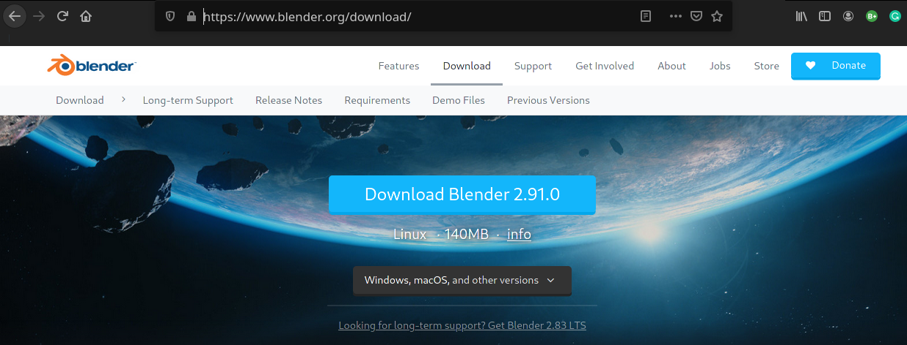
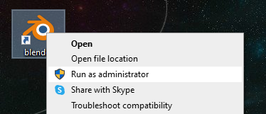
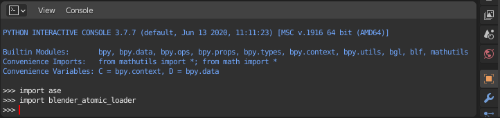
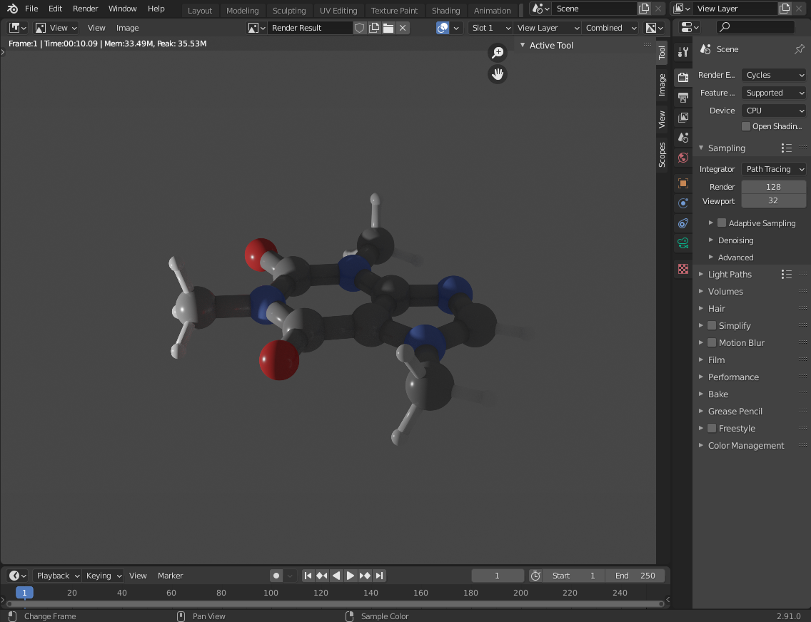
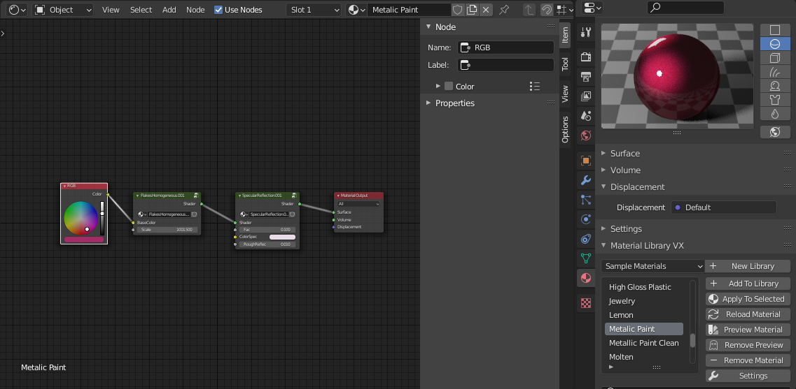
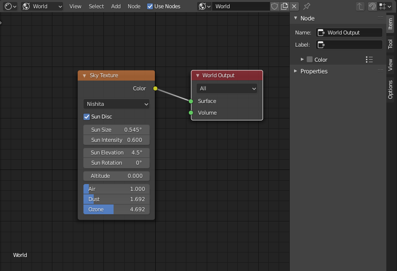
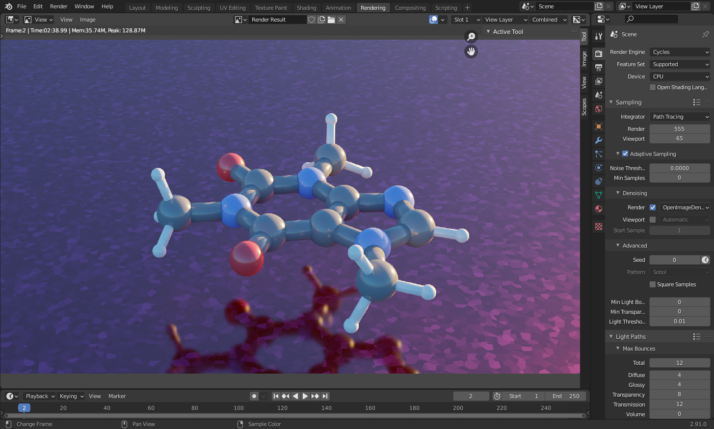

# Blender Atomic Loader

This is a simple library that allows to load atomic data into blender using ASE and draw spheres for atoms and cylinders for bonds. This README is meant to show how to use Blender to render a simple PDB or XYZ (or anything supported by ASE). 

The functions in here are pretty simple and most of them are meant for 2D systems made by a metal substrate with a molecule on top. However, this is just an example and can easily be extend to work with other systems.

**The following guide has been tested with Blender 2.90 and above. It should work for Blender 2.83 as well.**

## Downloading Blender

We suggest to download the last Blender version directly from the official [Blender download page](https://www.blender.org/download/).



## Installing the library

Blender comes with a internal python environment, where the library and it's dependencies (such as `ase`) need to be installed.

A simple way to do this is the following:

1) Only for **Windows users**: run Blender **with elevated privileges** (run as administrator);  

2) Open a "Text Editor" (`Shift F11`) and create an empty script (`+ New`)
3) Copy and paste the following in the editor (select either Option 1 or 2 by commenting/uncommenting):

```python
import subprocess
import sys
import os

# Get the pathe to the python executable
# For Linux users this will only work when downloading Blender directly from the official website. 
exe_name = [string for string in os.listdir(sys.prefix+'/bin/') if 'python' in string][0]
python_exe = os.path.join(sys.prefix, 'bin', exe_name)

# install and upgrade pip
subprocess.call([python_exe, "-m", "ensurepip"])
subprocess.call([python_exe, "-m", "pip", "install", "--upgrade", "pip"])

# Option 1: install directly from github
subprocess.call([python_exe, "-m", "pip", "install", "https://github.com/nanotech-empa/blender-atomic-loader/archive/main.zip"])

# Option 2 (developers): install from local source (e.g. from a git clone)
#subprocess.call([python_exe, "-m", "pip", "install", "-e", "path/to/blender-atomic-loader"])
```
4) Run the script (button with an arrow/`Alt P`) and wait
5) To confirm that the library is available, open the internal python console (`Shift F4`) and try `import ase`, `import blender_atomic_loader`. Restarting Blender might be needed.



## Example usage

### Quick demonstration: benzene

For a quick demonstration of the library, copy and paste the following code to the Blender text editor (`Shift F11`). The molecule is pre-defined using the `ase` library.

```python
import blender_atomic_loader as bl
import ase.build.molecule as molecule
c6h6 = molecule('C6H6')
bl.draw_molecule(c6h6)
```

That's all. To render your first image just hit (`F12`).

### Load molecule from file & draw it

Follow this simple example to render an image of caffeine. An example PDB can be found in the (`examples`) folder.

Load the PDB:

```python
from ase.io import read
import blender_atomic_loader as bl

# Read an example system (specify the correct path)
caffeine=read('caffeine.pdb')

# Draw the molecule 
bl.draw_molecule(caffeine)
```

Select the camera. After selecting the camera move it pressing (`g`) to the desired position. Switch to the camera view by pressing (`0`) on the numpad. Pressing (`Shift ~`) allows to refine the camera view even further. To get rapidly familiar on how to move the camera follow this [simple tutorial on youtube](https://www.google.com/url?sa=t&rct=j&q=&esrc=s&source=web&cd=&cad=rja&uact=8&ved=2ahUKEwjwoN79t7TtAhVB3KQKHZMfDY8QFjABegQIAxAC&url=https%3A%2F%2Fwww.youtube.com%2Fwatch%3Fv%3D4HAHY4bWe_E&usg=AOvVaw3HVpWgyK7mtSwXKoven1ZU).

Finally, to render the image just press (`F12`):



The default result is pretty basic, but not too bad already. We can easily improve it by adding a plane below the molecule pressing (`Shift A`) and then (`Mesh > Plane`). Select the plane and press (`g`) to move it to the desired position. 

From the menu (`Edit > Preferences > Add-ons`) activate [the materials VX library](https://www.youtube.com/watch?v=EHq39AmRU3Q). This will add a new tab (`Material Library VX`) under (`Material Properties`). [Here a simple tutorial](https://www.youtube.com/watch?v=QvgfUCEThXw&t=26s) on how to activate and use the materials VX library. For example, from the drop down menu select (`Sample Materials`), then scroll the list of pre-defined materials and select (`Metallic Paint`). Cick on the botton (`Apply To Selected`) to apply the chosen pre-defined material to the plane:



Now let's remove the lamp (select the lamp and press (`x`) and add some nicer HDRI lighting. For something more advanced follow [this tutorial on youtube](https://www.youtube.com/watch?v=RsAUfQlZH_w). We can keep this simple and just add a (`Sky Texture`) to our World's surface: enter in shade editor by pressing (`Shift F3`), remember to select (`World`) from the drop down menu, remove the default (`Background`) node and add a (`Sky Texture`) to our World surface:



 Once again, to render the image press (`F12`):



A few things to note:

* it is recommended to group atoms of the same type under a new collection. Do this select a group of atoms, type (`m`) and click on (`+ New Collection`)
* by default we use the CPK colour scheme combined with a standard reflective material. One can manually change or add new materials. An intersting add-on with loads of cool materials is [the materials VX library](https://www.youtube.com/watch?v=EHq39AmRU3Q)
* if you add a new material and assign it to a specific object you can propagate the same material to other objects by selecting the target objects and then pressing (`CTRL-L > Make Links > Materials`)
* to rescale the size of a group of objects without scaling the relative distances (e.g. increase the size of all the oxygens) first select the objects, then, while in the (`Object Mode`) or (`Edit Mode`), set the pivot center to (`Individual Origins`), and finaly press (`s`) and scale the objects. 

## Possible issues

When rendering from a laptop it can happen that the memory is not enough to render the image. The first suggestion is to remove all the atoms not visble from the camera view and the second is to render the image from the command line, without using the GUI (even better if you ssh to a larger machine with blender installed!):

```bash
blender -b test.blend -o output_name -f 1
```

## Load a short trajectory and render it 

Follow this simple example to render a short video of LJ38 nanocluster in vacuum. An example trajectory file can be found in the (`examples`) folder. Load the trajectory, draw the atoms and insert the corresponding keyframes:

```python
import blender_atomic_loader as bl
from ase.io import read

# Load the trajectory with ASE
traj=read("example/lj38-trajectory.pdb",":")

# Loop over the atoms
for at_n,at in enumerate(traj[0]):
    # create a sphere for each atom
    bl.create_sphere(diameter=0.65)
    obj = bpy.context.active_object
    # Loop over the trajectory frames
    for i_fr,fr in enumerate(traj):
        obj.location=fr[at_n].position
        obj.keyframe_insert(data_path="location", frame=(i_fr))
        
# Adjust camera's location
scene = bpy.data.scenes["Scene"]
scene.camera.location=[11,-8,9]
```

Press (`CTRL + F12`) or select the menu (`Render > Render Animation`) to render the animation. Before rendering check the properties of the video in the properties window (`Shif + F7`), under the (`Output Properties`) Tab and define your desired final resulution and the output path. You can instruct Blender to render directly a video, or you can just render a sequence of images. In the case you render a sequence of images, you can encode it into a video using an encoder of your choice. For example, Linux user can do it from the command line using ffmpeg:

```bash
ffmpeg -r 25 -i %04d.png -c:v libx264 -vf fps=25 -pix_fmt yuv420p out.mp4
```

Here an example result:


Follow [this tutorial](https://blender.stackexchange.com/questions/15142/how-to-render-an-animation-as-video-in-blender) to better learn how to set up the render and export the animatio in your favourite video format.
