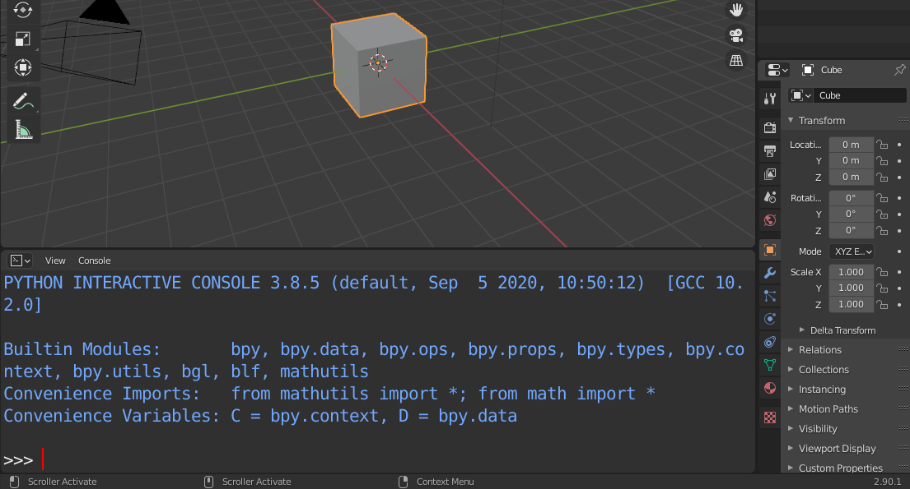

# Blender Atomic Loader

This is a simple library that allows to load atomic data into blender using ASE and draw spheres for atoms and cylinders for bonds. This README is meant to be a rimender for myself on how to setup blender with ASE, and how to use Blender to render a simple PDB or XYZ (or anything supported by ASE).

**All this have been tested with Blender 2.83 and Blender 2.90**

## Requirements

To load atomic structures from a PDB (or XYZ) file ASE is need. Blender has an internal python interpreter which has nothing to do with that of the system, thus we need to it manually.

The first step is too check what Pyhton version Blender comes with. To check this, just start Blender and open the Python console:



The idea is to install ase using pip in a local virtual environment having the same exact version of Python as Blender:

```
$ pyenv virtualenv 3.8.5 ase
$ pyenv local ase
$ pip install ase
```

If this works ou smoothly, we can proceed copying the necessary modules to your local Blender path:

cp -r /home/piero/.local/lib/python3.8/site-packages/ase ~/.config/blender/2.83/scripts/modules

```
$ mkdir ~/.config/blender/2.90/scripts/modules
$ cp -r $PATH_VIRTUALENV/lib/python3.8/site-packages/ase ~/.config/blender/2.90/scripts/modules
$ cp -r $PATH_VIRTUALENV/lib/python3.8/site-packages/scipy ~/.config/blender/2.90/scripts/modules
$ cp -r $PATH_VIRTUALENV/lib/python3.8/site-packages/scipy.libs ~/.config/blender/2.90/scripts/modules
```

Everything should work now. You can remove the local virtual environment, open blender and load ase:


